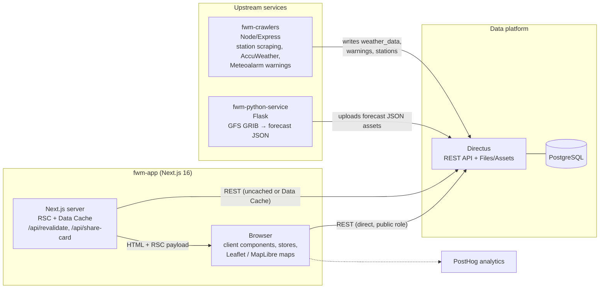
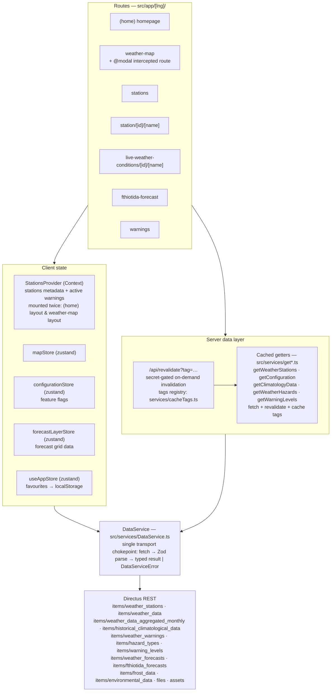
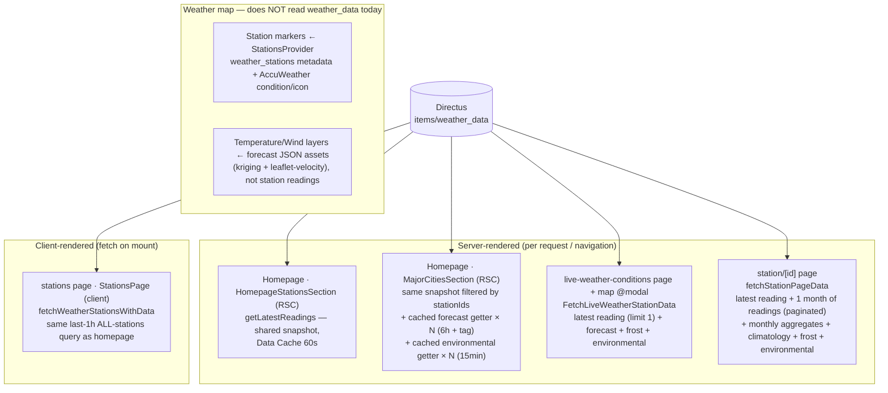

# FWM App — Current Architecture

> Reference document. Reflects the codebase as of 2026-07-20 (branch `development`, v1.18.x).
> Companion HTML version (rendered diagrams, offline): [`architecture.html`](./architecture.html)
> Target realtime design: [`weather-data-websocket.md`](./weather-data-websocket.md)

## 1. System context

The Next.js app is a **read-only consumer of Directus REST**. All writes happen upstream
(crawlers, GRIB processing); the app never mutates data.

Key property: **the browser talks to Directus directly** (base URL is `NEXT_PUBLIC_APP_BASE_URL`,
public/anonymous role). The Next.js server is not a proxy for client-side calls — client and
server both go straight to Directus through the same `DataService`.

## 2. Frontend layering

Caching rules today:

| Path | Cache | Invalidation |
|---|---|---|
| `get*.ts` getters (stations metadata, config/flags, climatology, hazards, warning levels) | Next.js Data Cache, `revalidate` window + tag | time-based or `/api/revalidate` |
| `getLatestReadings` (last-1h all-stations `weather_data` snapshot) | Data Cache, 60s window | time-based only — **never** wire a per-insert Flow to this tag |
| `getForecastByStation` (per-station latest forecast) | Data Cache, 6h window + `forecasts` tag | Directus Flow on `weather_forecasts` POSTs `/api/revalidate?tag=forecasts` after each generation run |
| `getEnvironmentalData` (per-cluster AQI/UV) | Data Cache, 15min window | time-based only |
| Everything else through `DataService` (incl. **per-station `weather_data` reads** and history) | **uncached** — hits Directus on every render/mount | n/a |

Invalidation rule of thumb: **tag** what's written in discrete batches (forecasts, config,
stations metadata), **TTL** what changes on a rolling cadence (readings snapshot, environmental),
never tag what's written continuously (`weather_data` inserts — that's the websocket's job).

## 3. `weather_data` flow — the detail that matters for the websocket decision

Five surfaces consume `items/weather_data`. None of them poll; freshness is bound to
page load / navigation.

### Consumer matrix

| Surface | Component | Runs | Query against `weather_data` | Refresh |
|---|---|---|---|---|
| Homepage — stations grid | `HomepageStationsSection` (RSC) | server, cached 60s | `getLatestReadings` shared snapshot | page load (≤60s stale) |
| Homepage — major cities | `MajorCitiesSection` (RSC) | server, cached | same snapshot filtered by `stationIds`; forecast/environmental via cached getters | page load (≤60s stale) |
| `/stations` list | `StationsPage` (client) | browser, on mount | last 1h, all stations — still a direct uncached client fetch | mount only |
| Live conditions page + map modal | `FetchLiveWeatherStationData` (server) | server, per navigation | latest reading, `limit=1` | navigation |
| `/station/[id]` | `fetchStationPageData` (server) | server, per navigation | latest + 1 month history | navigation |
| Weather map markers | `StationsProvider` → `ClusterStationsLayer` | browser, on mount | **none** — AccuWeather condition from `weather_stations` | mount only |

## 4. Observed inefficiencies (the "bloat")

Addressed 2026-07-20 by the cached-getter layer (`getLatestReadings`, `getForecastByStation`,
`getEnvironmentalData`):

- ~~Homepage fan-out~~ — steady-state, most homepage renders now hit Directus **zero** times for
  these sections: one shared 60s snapshot feeds both the stations grid and major cities, and
  forecast/environmental come from cadence-matched cached getters shared with the station page
  and live-conditions loaders.
- Behavioral note: major-city cards now inherit the snapshot's last-1h window — a stalled station
  drops its card instead of showing stale data (previously the per-station query had no window).

Still open — these are the pressure points the Directus WebSocket design addresses, see
[`weather-data-websocket.md`](./weather-data-websocket.md):

1. **`/stations` still fetches the last-1h scan client-side** on every mount, uncached — the
   browser cannot read the server Data Cache; the shared client store arrives with the realtime
   work.
2. **`StationsProvider` is mounted per layout** (home and weather-map), so navigating between them
   re-fetches stations metadata and warnings.
3. **Staleness:** a user sitting on the map or stations list sees data frozen at mount time, while
   crawlers write new readings continuously.
4. **`DataService` instantiated per component** — harmless but signals no shared data layer on the
   client.
