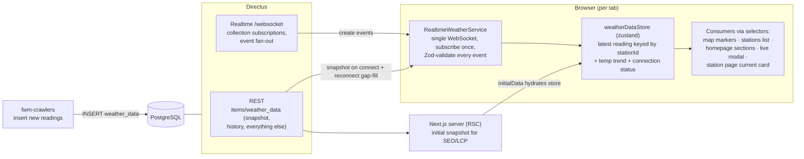
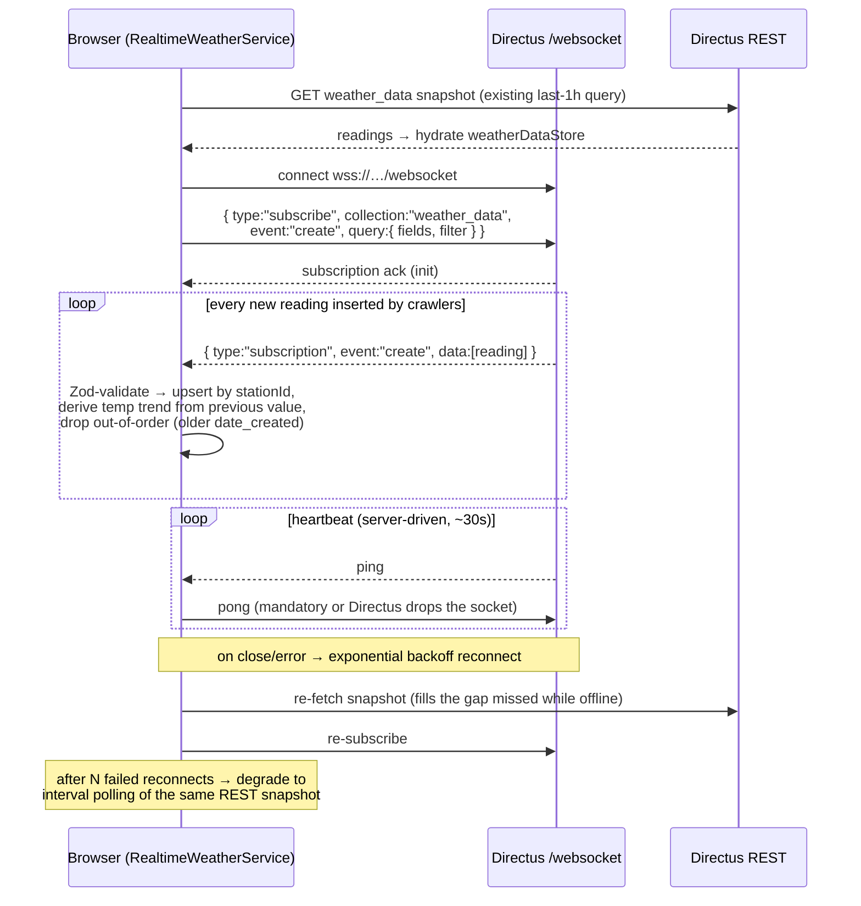
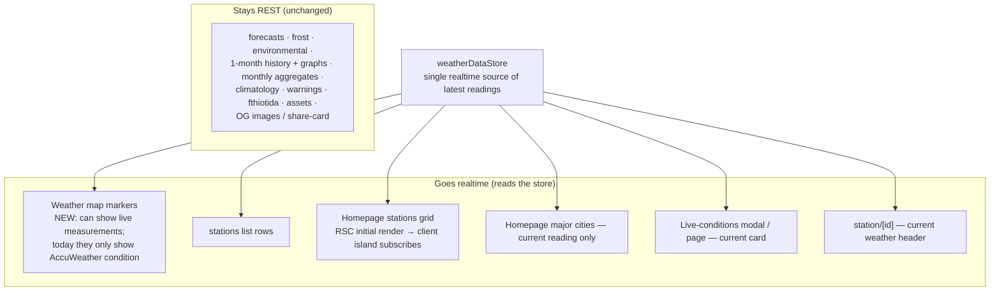

# FWM App — Target Architecture: `weather_data` over Directus WebSocket

> Decision: browsers connect **directly to Directus Realtime** (same trust model as today's public
> REST calls). All live-reading surfaces share **one realtime store**; historical, climatology,
> forecast, frost and environmental data stay on REST.
> Current state baseline: [`current-architecture.md`](./current-architecture.md)

## 1. Target topology



Principles:

- **REST bootstraps, WS maintains.** The existing last-1h snapshot query hydrates the store
  (server-side where the surface is an RSC, client-side otherwise); the socket only applies
  deltas. WS is never the source of the first paint.
- **One socket, one subscription, one store per tab.** No component opens its own socket.
  Consumers read via zustand selectors so only affected markers/rows/cards re-render.
- **Directus does the fan-out.** No new backend service to build or operate; scale limit is
  concurrent WS connections on the Directus instance (monitor, and cap with fallback polling).

## 2. Socket lifecycle



Client-side rules baked into the service:

- **Validation at the boundary stays.** Every WS payload passes the same Zod schema family as REST
  responses (`schemas/WeatherData.ts` subset) before touching the store — the "Zod at the API
  boundary" rule applies to the socket too.
- **Ordering guard:** upsert only if `date_created` is newer than the stored reading.
- **Trend for free:** the store keeps the previous value per station, replacing today's
  fetch-two-readings-and-reduce hack in `fetchWeatherStationsWithData`.
- **Tab lifecycle:** pause/close socket on `visibilitychange`/`pagehide` after a grace period;
  resume with snapshot + resubscribe (mobile battery, Directus connection budget).
- **Feature flag:** gate the whole realtime path behind a `configurationStore` feature flag
  (existing `getConfiguration` mechanism) → instant kill-switch back to current behavior.

## 3. Impact per consuming surface



| Surface | Today | After | Structural change required |
|---|---|---|---|
| Homepage — stations grid | RSC reads 60s-cached `getLatestReadings` snapshot, static until reload | RSC keeps the snapshot fetch (SEO/LCP unchanged) → passes `initialData` to `HomepageStationsSectionView`, which becomes a client island subscribed to the store | small — the view component is already split out |
| Homepage — major cities | RSC reads same snapshot + cached forecast/environmental getters | current reading comes from the store (selector on `stationIds`); forecast + environmental stay on their cached REST getters | current-temp portion moves into a client island |
| `/stations` list | client fetch on mount, then frozen | drops its own fetch entirely; reads the store (store bootstraps itself if not yet hydrated) | delete `getWeatherData`, subscribe |
| Weather map markers | AccuWeather condition from `weather_stations`; **no** `weather_data` | markers/cluster popovers can additionally show live temp/wind per station; `StationsProvider` still owns metadata (names, coords, translations) | new — this surface starts consuming `weather_data` for the first time; decide per-marker what to display |
| Live-conditions modal + page | server fetch per open, frozen while open | server render unchanged; current card subscribes to that station's store entry → updates while the modal is open | wire one selector into `StationModalBody` |
| `/station/[id]` | server fetch per navigation | current-weather header subscribes; graphs/history stay REST (optional later: append live points to the last-day graph) | wire one selector into the header |
| Warnings, forecasts, everything else | REST | REST — out of scope | none |

**Net effect on load:** the server side of the scan is already collapsed by `getLatestReadings`
(one upstream call per 60s window); realtime removes the remaining client-side scans (`/stations`
mounts) and replaces reload-driven freshness with event-driven updates — "once per tab per
(re)connect" plus deltas.

## 4. Directus prerequisites

| Item | Setting / action |
|---|---|
| Enable realtime | `WEBSOCKETS_ENABLED=true` (WS endpoint at `wss://<base>/websocket`) |
| Auth mode | `WEBSOCKETS_REST_AUTH=public` — anonymous sockets get the **public role's** permissions, mirroring today's REST trust model |
| Permissions | public role: read on `weather_data`, restricted to exactly the fields the app queries (measurements + `weather_station_id` relation fields) |
| Heartbeat | default `WEBSOCKETS_HEARTBEAT_ENABLED=true` (~30s); client must answer `ping` with `pong` |
| Reverse proxy | ensure the proxy in front of Directus passes `Upgrade`/`Connection` headers and has an idle timeout > heartbeat period |
| Capacity | load-test concurrent sockets ≈ expected concurrent tabs; each event fans out to all subscribers |
| Verify | `wscat -c wss://<base>/websocket` → send subscribe frame → insert a test reading → observe event |

Subscription frame (fields mirror the REST query, so the Zod schema is shared):

```json
{
    "type": "subscribe",
    "collection": "weather_data",
    "event": "create",
    "query": {
        "fields": [
            "date_created", "temperature", "barometer", "humidity",
            "percipitation", "rainrate", "windspd", "winddir",
            "weather_condition", "weather_condition_icon",
            "weather_station_id.id", "weather_station_id.name",
            "weather_station_id.translations.languages_code",
            "weather_station_id.translations.name"
        ]
    }
}
```

## 5. New / changed modules in `fwm-app`

| Module | Role |
|---|---|
| `src/services/RealtimeWeatherService.ts` *(new)* | socket ownership: connect, subscribe, heartbeat, backoff, snapshot gap-fill, polling fallback. No React inside. |
| `src/stores/weatherDataStore.ts` *(new)* | zustand: `readings: Record<stationId, Reading>`, `previous` per station, `connectionState`; upsert with ordering guard; selectors per station and for the full list |
| `src/schemas/WeatherData.ts` | add/reuse an event-payload schema for WS frames |
| `StationsProvider` | unchanged responsibility (metadata + warnings) — it does **not** absorb realtime; readings live in the store |
| Feature flags (`getConfiguration`) | `realtimeWeatherData` flag as kill-switch |

## 6. Suggested migration order

1. **Directus side:** enable websockets, scope public-role fields, verify with `wscat`, load-test.
2. **Foundations:** `weatherDataStore` + `RealtimeWeatherService` + event schema, behind the flag;
   ship dark (no consumer).
3. **`/stations` page** — pure client, simplest swap, easiest rollback.
4. **Homepage stations grid** — RSC → hybrid island with `initialData`.
5. **Live-conditions modal + station page current card** — single-station selectors.
6. **Map markers** — last, because it's a product decision (what to show live) not just plumbing.
7. **Cleanup:** remove the duplicated snapshot/dedupe logic from `DataService` consumers; keep the
   snapshot query itself (bootstrap + fallback).

## 7. Risks & open questions

- **Connection scale on Directus** — one socket per tab. Mitigations: visibility-based disconnect,
  polling fallback cap, and (only if it ever becomes a real problem) revisit the server-relay
  topology; the client design above is transport-agnostic enough to swap behind
  `RealtimeWeatherService`.
- **Relational field depth in events** — event payloads honor the subscription `query.fields`, but
  keep the field list shallow; anything heavy (prefecture translations, cluster, header_bg) should
  come from `StationsProvider` metadata joined client-side by `stationId`, not from every event.
- **Map marker product question** — live readings vs. AccuWeather condition icons: additive or
  replacement? Decide before step 6.
- **SEO invariant** — homepage and station pages must keep server-rendering the snapshot; realtime
  is a hydration-time enhancement only.
